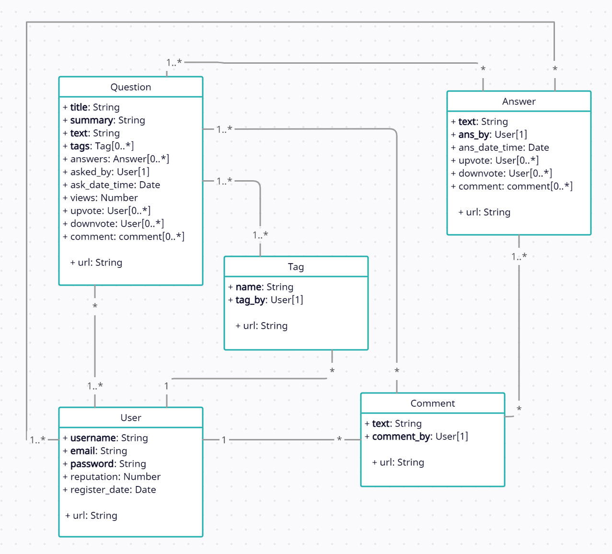

<h1>Fake Stack Overflow - Final</h1>

<h2>Repository Focus</h2>

In this final repository, our focus is to develop a server using Node.js and leverage MongoDB as the back-end database. With Node.js, we can host both static and dynamic resources, creating interactive web applications. MongoDB was chosen as the preferred backend database due to its proven capabilities and our confidence in working with it. This final project builds upon the features developed in HW3, which also utilized MongoDB, while also introduces additional functionalities such as encryption, user creation, and session/cookie management. These enhancements further enrich the site's capabilities and provide a more comprehensive user experience.

This assignment serves as a culmination of your learning journey, encompassing concepts such as server-side programming, database management, front-end integration, and security measures. It is an opportunity to showcase your comprehensive understanding and practical application of these concepts in developing a robust and scalable web application.

<h2>Tools used:</h2>
<ul>
    <li>
    <strong>MongoDB:</strong> MongoDB is a popular NoSQL database used for storing and retrieving data. It provides a flexible, scalable, and document-oriented approach to data storage. MongoDB works well with Node.js and is widely used in modern web application development. It allows you to store structured or unstructured data and provides powerful querying capabilities.
    </li>
    <li>
    <strong>Bcrypt:</strong> Bcrypt is a password hashing library used for securely storing user passwords. It provides a cryptographic hash function that converts passwords into irreversible, salted hashes. Bcrypt enhances security by making it computationally expensive to crack hashed passwords, protecting user credentials from potential breaches.
    </li>
    <li>
    <strong>Express.js:</strong> Express.js is a popular web application framework for Node.js. It provides a set of robust features and middleware that simplifies the process of building web applications. Express.js helps in handling routes, requests, and responses, making it easier to develop the server-side of your application.
    </li>
    <li>
    <strong>Nodemon:</strong> Nodemon is a utility tool that automatically restarts your server whenever changes are made to your code. It helps in the development process by saving you the effort of manually restarting the server after every code modification. Nodemon improves productivity and speeds up the development workflow.
    </li>
    <li>
    <strong>Axios:</strong> Axios is a popular JavaScript library used for making HTTP requests from the client-side of your application. It provides an easy-to-use API for sending asynchronous requests to the server and handling the responses. Axios simplifies the process of fetching data from external APIs or interacting with your own server-side endpoints.
    </li>
    <li>
    <strong>CORS:</strong> CORS stands for Cross-Origin Resource Sharing. It is a mechanism that allows web browsers to securely make requests to a different domain than the one the website originated from. CORS is important when your client-side code needs to communicate with a server hosted on a different domain. It enables the server to control which origins are allowed to access its resources, ensuring secure and controlled data exchange between different domains.
    </li>
</ul>

<h2>Pre-Setup</h2>

This project uses MongoDB, Node.js, express, mongoose, nodemon, axios, cors, bcrypt, and no additional packages.
For the project to run you need to npm install all the packages mentioned in both the client and server directory.

<h2>Server IP/Port</h2>

Database Instance runs at <code>mongodb://127.0.0.1:27017/fake_so</code>

Client Instance runs at <code>https://localhost:3000</code>

Server Instance runs at <code>https://localhost:8000</code>

<h2>Startup</h2>

Personally I run my server with <code>npx nodemon server.js</code> in the server directory. And client with <code>npm start</code> in the client directory. I open my database with <code>"C:\Program Files\MongoDB\Server\5.0\bin\mongod.exe" --dbpath="c:\data\db"</code>

After the instances are opened you would want to populate the database by navigating to the server directory and running the populate_db.js with the argument mongodb://127.0.0.1:27017/fake_so(<code>node populate_db.js mongodb://127.0.0.1:27017/fake_so</code>). This will populate the database for you. 

<h2>Populate Database</h2>

You can alter the data that is generated with <code>populate_db.js</code> to your liking. If you wish to create your own custom data, you can use the following provided methods in the populate section of the code.

<strong>userCreate(username, email, hashed password, register_date)</strong> 
username: String, REQUIRE  
email: String, REQUIRE 
hashed password: String (processed by bcrypt.hash), REQUIRE 
reputation: Integer 
register_date: Date objects 

<strong>tagCreate(name, tag_by)</strong> 
name: String, REQUIRE 
tag_by: User object, REQUIRE 

<strong>commentCreate(text,comment_by)</strong> 
text: String, REQUIRE 
comment_by: User object, REQUIRE 

<strong>answerCreate(text, ans_by, ans_date_time, upvote, downvote, comment)</strong> 
text:String, REQUIRE 
ans_by: User object, REQUIRE 
ans_date_time: Date object 
upvote: array of User objects 
downvote: array of User objects 
comment : array of Comment objects 

<strong>questionCreate(title, summary, text, tags, answers, asked_by, ask_date_time, views, upvote, downvote, comment)</strong> 
title: String, REQUIRE 
summary: String, REQUIRE 
text: String, REQUIRE 
tags: array of Tag objects, REQUIRE 
answers: array of Answer objects 
asked_by: User objects 
ask_date_time: Date object 
views: Integer 
upvote: array of User objects 
downvote: array of User objects 
comment : array of Comment objects 

<h2>Test Users</h2>

You can test project with the following user:

username: some1  
email: some1@gmail.com 
password:123 
reputation: 0 

username: some2  
email: some2@gmail.com 
password:1234 
reputation: 100 

username: some3  
email: some3@gmail.com 
password:1235 
reputation: 50 

username: some4  
email: some4@gmail.com 
password:1236 
reputation: 101 

<h2>UML Diagram</h2>

The UML model describes the schema for all documents in the MongoDB database

<h2>Resources</h2>

Here are some useful resources:

<ul>
  <li><a href="https://www.mongodb.com/docs/">MongoDB Documentation</a></li>
  <li><a href="https://www.mongodb.com/docs/compass/current/">MongoDB Compass Documentation</a></li>
  <li><a href="https://expressjs.com/">Express.js Documentation</a></li>
  <li><a href="https://mongoosejs.com/docs/">Mongoose Documentation</a></li>
  <li><a href="https://nodemon.io/">Nodemon Documentation</a></li>
  <li><a href="https://axios-http.com/">Axios Documentation</a></li>
  <li><a href="https://developer.mozilla.org/en-US/docs/Web/HTTP/CORS">CORS Documentation</a></li>
  <li><a href="https://www.npmjs.com/package/bcrypt">Bcrypt Documentation</a></li>
</ul>

You will find the detailed tasks and instructions in the provided PDF document.

<h2>Assignment Navigation:</h2>
<li style="display: inline-block; margin-right: 20px;"><a href="previous_assignment_url">( Previous )</a></li>

